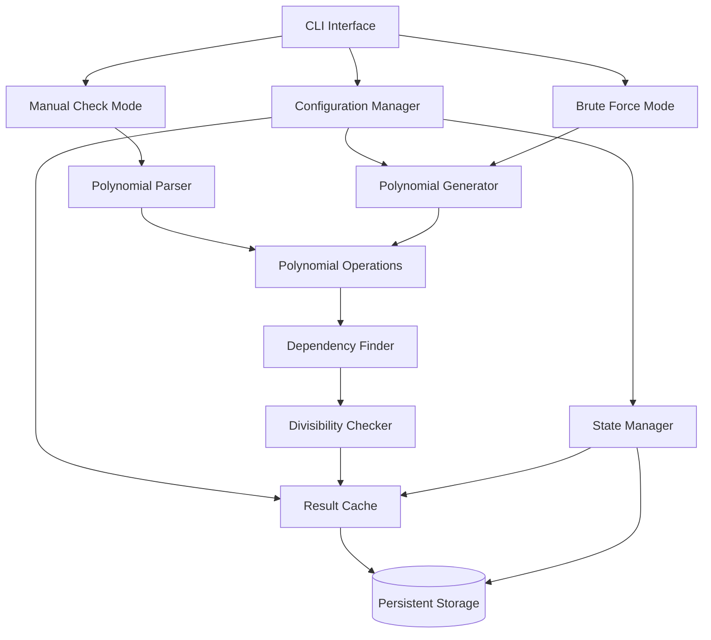

# Polynomial Algebraic Dependency Checker - Architecture

## Overview

This system analyzes pairs of polynomials f, g ∈ Z[x,y] to find algebraic dependencies q(x, f, g) = 0 and verify divisibility conditions.

## Mathematical Problem

For each pair (f, g) of polynomials in Z[x,y]:
1. Find polynomial q ∈ Q[x, u, v] such that q(x, f(x,y), g(x,y)) = 0
2. Check if ∂q/∂f is divisible by ∂q/∂x
3. Check if ∂q/∂g is divisible by ∂q/∂x

## System Requirements

### Core Features
- **Brute Force Mode**: Enumerate all polynomial pairs (f, g) up to configurable degree
- **Manual Check Mode**: Test specific polynomial pairs
- **State Persistence**: Save progress and resume after restart
- **Result Caching**: Store results for each (f, g) pair to avoid recomputation
- **Configurable Parameters**: Adjustable max degree, coefficient ranges, enumeration strategy

### Input/Output
- **Input Format**: Polynomials as strings like `x^2 + y^2 - 1`
- **Coefficient Ring**: Z (integers)
- **Output**: Results stored persistently with polynomial pairs and their dependencies

## System Architecture



## Module Design

### 1. Configuration Manager (`config.py`)
**Purpose**: Manage all configurable parameters

**Configuration Parameters**:
```python
class Config:
    # Polynomial generation
    max_degree_f: int = 2          # Max degree for f
    max_degree_g: int = 2          # Max degree for g
    max_degree_q: int = 3          # Max degree for q
    coeff_min: int = -2            # Min coefficient value
    coeff_max: int = 2             # Max coefficient value
    
    # Enumeration strategy
    enum_strategy: str = "lexicographic"  # or "degree_first", "random"
    skip_trivial: bool = True      # Skip constant polynomials
    
    # Storage
    cache_file: str = "results.db"
    state_file: str = "state.json"
    
    # Performance
    batch_size: int = 100          # Process in batches
    checkpoint_interval: int = 10  # Save state every N pairs
```

### 2. Polynomial Module (`polynomial.py`)
**Purpose**: Use SymPy for all polynomial operations

**Why SymPy?**
- Built-in parsing: `sympify("x^2 + y^2 - 1")` handles parsing automatically
- Polynomial operations: derivatives, substitution, division all built-in
- Symbolic computation: exact arithmetic with rationals
- No need to write custom parser or operations

**Simple Wrapper**:
```python
from sympy import symbols, sympify, Poly, div, degree
from sympy.abc import x, y, u, v

def parse_polynomial(expr: str):
    """Parse string using SymPy - one line!"""
    return sympify(expr.replace('^', '**'))

def partial_derivative(poly, var):
    """SymPy handles this"""
    return poly.diff(var)

def substitute(poly, var, expr):
    """SymPy handles this"""
    return poly.subs(var, expr)

def is_divisible(dividend, divisor):
    """Check divisibility using SymPy's div"""
    _, remainder = div(dividend, divisor)
    return remainder == 0

def poly_hash(poly):
    """Hash for caching"""
    return hash(str(poly))
```

### 5. Polynomial Generator (`generator.py`)
**Purpose**: Generate polynomial pairs for brute force

**Enumeration Strategies**:

#### Lexicographic Strategy
Generate polynomials in lexicographic order of coefficients:
```
0, 1, -1, 2, -2, ...
x, -x, 2x, -2x, ...
y, -y, 2y, -2y, ...
x + y, x - y, ...
```

#### Degree-First Strategy
Generate all polynomials of degree 0, then degree 1, then degree 2, etc.:
```
Degree 0: 0, 1, -1, 2, -2, ...
Degree 1: x, -x, 2x, y, x+y, x-y, ...
Degree 2: x^2, xy, y^2, x^2+y, ...
```

#### Implementation
```python
class PolynomialGenerator:
    def __init__(self, config: Config):
        self.config = config
        self.strategy = self._get_strategy()
    
    def generate_pairs(self) -> Iterator[Tuple[Polynomial, Polynomial]]:
        """Generate (f, g) pairs according to strategy"""
        for f in self._generate_polynomials(self.config.max_degree_f):
            for g in self._generate_polynomials(self.config.max_degree_g):
                if self._should_skip(f, g):
                    continue
                yield (f, g)
    
    def _generate_polynomials(self, max_degree: int) -> Iterator[Polynomial]:
        """Generate all polynomials up to max_degree"""
        pass
    
    def _should_skip(self, f: Polynomial, g: Polynomial) -> bool:
        """Check if pair should be skipped (e.g., both constant)"""
        pass
```

### 6. Dependency Finder (`dependency_finder.py`)
**Purpose**: Find polynomial q such that q(x, f, g) = 0

**Algorithm**:
1. Generate candidate polynomials q ∈ Q[x, u, v] up to max degree
2. For each candidate q:
   - Substitute u → f(x,y), v → g(x,y)
   - Check if result is identically zero
   - If yes, return q

**Optimization Strategies**:
- Use Gröbner basis techniques
- Exploit symmetries
- Early termination on degree bounds

```python
class DependencyFinder:
    def __init__(self, config: Config):
        self.config = config
    
    def find_dependency(self, f: Polynomial, g: Polynomial) -> Optional[Polynomial]:
        """
        Find q(x, u, v) such that q(x, f(x,y), g(x,y)) = 0
        Returns None if no dependency found within degree bounds
        """
        for q in self._generate_candidates():
            if self._is_dependency(q, f, g):
                return q
        return None
    
    def _generate_candidates(self) -> Iterator[Polynomial]:
        """Generate candidate q polynomials in Q[x,u,v]"""
        pass
    
    def _is_dependency(self, q: Polynomial, f: Polynomial, g: Polynomial) -> bool:
        """Check if q(x, f(x,y), g(x,y)) = 0"""
        substituted = substitute(substitute(q, 'u', f), 'v', g)
        return substituted.is_zero()
```

### 7. Divisibility Checker (`divisibility.py`)
**Purpose**: Check if ∂q/∂f : ∂q/∂x and ∂q/∂g : ∂q/∂x

**Algorithm**:
```python
class DivisibilityChecker:
    def check_conditions(self, q: Polynomial, f: Polynomial, g: Polynomial) -> Dict[str, bool]:
        """
        Check divisibility conditions:
        1. ∂q/∂u divisible by ∂q/∂x (where u represents f)
        2. ∂q/∂v divisible by ∂q/∂x (where v represents g)
        
        Returns: {
            'df_divisible': bool,
            'dg_divisible': bool,
            'both_divisible': bool
        }
        """
        dq_dx = partial_derivative(q, 'x')
        dq_du = partial_derivative(q, 'u')
        dq_dv = partial_derivative(q, 'v')
        
        df_divisible = is_divisible(dq_du, dq_dx)
        dg_divisible = is_divisible(dq_dv, dq_dx)
        
        return {
            'df_divisible': df_divisible,
            'dg_divisible': dg_divisible,
            'both_divisible': df_divisible and dg_divisible
        }
```

### 8. State Manager (`state.py`)
**Purpose**: Persist and restore brute force progress

**State Information**:
```python
class BruteForceState:
    """Tracks progress of brute force enumeration"""
    
    def __init__(self):
        self.last_f_index: int = 0      # Index of last processed f
        self.last_g_index: int = 0      # Index of last processed g
        self.total_pairs_checked: int = 0
        self.pairs_with_dependency: int = 0
        self.start_time: datetime = None
        self.last_checkpoint: datetime = None
    
    def save(self, filepath: str):
        """Save state to JSON file"""
        with open(filepath, 'w') as f:
            json.dump(self.__dict__, f, default=str)
    
    @classmethod
    def load(cls, filepath: str) -> 'BruteForceState':
        """Load state from JSON file"""
        if not os.path.exists(filepath):
            return cls()
        with open(filepath, 'r') as f:
            data = json.load(f)
            state = cls()
            state.__dict__.update(data)
            return state
```

### 9. Result Cache (`cache.py`)
**Purpose**: Store and retrieve results for polynomial pairs

**Database Schema** (SQLite):
```sql
CREATE TABLE results (
    id INTEGER PRIMARY KEY AUTOINCREMENT,
    f_poly TEXT NOT NULL,           -- String representation of f
    g_poly TEXT NOT NULL,           -- String representation of g
    f_hash TEXT NOT NULL,           -- Hash of f for quick lookup
    g_hash TEXT NOT NULL,           -- Hash of g for quick lookup
    q_poly TEXT,                    -- Dependency polynomial (NULL if none found)
    df_divisible BOOLEAN,           -- ∂q/∂f : ∂q/∂x
    dg_divisible BOOLEAN,           -- ∂q/∂g : ∂q/∂x
    both_divisible BOOLEAN,         -- Both conditions satisfied
    timestamp DATETIME DEFAULT CURRENT_TIMESTAMP,
    UNIQUE(f_hash, g_hash)
);

CREATE INDEX idx_hashes ON results(f_hash, g_hash);
CREATE INDEX idx_both_divisible ON results(both_divisible);
```

**Implementation**:
```python
class ResultCache:
    def __init__(self, db_path: str):
        self.conn = sqlite3.connect(db_path)
        self._create_tables()
    
    def get_result(self, f: Polynomial, g: Polynomial) -> Optional[Dict]:
        """Check if result exists for this pair"""
        f_hash = hash(f)
        g_hash = hash(g)
        cursor = self.conn.execute(
            "SELECT * FROM results WHERE f_hash = ? AND g_hash = ?",
            (str(f_hash), str(g_hash))
        )
        row = cursor.fetchone()
        return self._row_to_dict(row) if row else None
    
    def save_result(self, f: Polynomial, g: Polynomial,
                   q: Optional[Polynomial], divisibility: Dict[str, bool]):
        """Save result for polynomial pair"""
        self.conn.execute("""
            INSERT OR REPLACE INTO results
            (f_poly, g_poly, f_hash, g_hash, q_poly, df_divisible, dg_divisible, both_divisible)
            VALUES (?, ?, ?, ?, ?, ?, ?, ?)
        """, (
            f.to_string(), g.to_string(),
            str(hash(f)), str(hash(g)),
            q.to_string() if q else None,
            divisibility.get('df_divisible'),
            divisibility.get('dg_divisible'),
            divisibility.get('both_divisible')
        ))
        self.conn.commit()
    
    def get_statistics(self) -> Dict:
        """Get summary statistics"""
        cursor = self.conn.execute("""
            SELECT
                COUNT(*) as total,
                SUM(CASE WHEN q_poly IS NOT NULL THEN 1 ELSE 0 END) as with_dependency,
                SUM(CASE WHEN both_divisible = 1 THEN 1 ELSE 0 END) as both_divisible
            FROM results
        """)
        return dict(cursor.fetchone())
```

### 10. Main Orchestrator (`main.py`)
**Purpose**: Coordinate all components and provide CLI interface

**Brute Force Mode**:
```python
class BruteForceRunner:
    def __init__(self, config: Config):
        self.config = config
        self.generator = PolynomialGenerator(config)
        self.finder = DependencyFinder(config)
        self.checker = DivisibilityChecker()
        self.cache = ResultCache(config.cache_file)
        self.state = BruteForceState.load(config.state_file)
    
    def run(self):
        """Run brute force search with checkpointing"""
        pairs = self.generator.generate_pairs()
        
        # Skip to last checkpoint
        for _ in range(self.state.last_f_index * self.state.last_g_index):
            next(pairs)
        
        checkpoint_counter = 0
        
        for f, g in pairs:
            # Check cache first
            cached = self.cache.get_result(f, g)
            if cached:
                print(f"Skipping cached pair: {f.to_string()}, {g.to_string()}")
                continue
            
            # Find dependency
            q = self.finder.find_dependency(f, g)
            
            # Check divisibility if dependency found
            divisibility = {}
            if q:
                divisibility = self.checker.check_conditions(q, f, g)
            
            # Save result
            self.cache.save_result(f, g, q, divisibility)
            
            # Update state
            self.state.total_pairs_checked += 1
            if q:
                self.state.pairs_with_dependency += 1
            
            # Checkpoint
            checkpoint_counter += 1
            if checkpoint_counter >= self.config.checkpoint_interval:
                self.state.save(self.config.state_file)
                checkpoint_counter = 0
                print(f"Checkpoint: {self.state.total_pairs_checked} pairs checked")
```

**Manual Check Mode**:
```python
class ManualChecker:
    def __init__(self, config: Config):
        self.config = config
        self.parser = PolynomialParser()
        self.finder = DependencyFinder(config)
        self.checker = DivisibilityChecker()
        self.cache = ResultCache(config.cache_file)
    
    def check_pair(self, f_str: str, g_str: str):
        """Check specific polynomial pair"""
        f = self.parser.parse(f_str)
        g = self.parser.parse(g_str)
        
        # Check cache
        cached = self.cache.get_result(f, g)
        if cached:
            print("Result found in cache:")
            self._print_result(cached)
            return
        
        # Find dependency
        print(f"Finding dependency for f={f_str}, g={g_str}...")
        q = self.finder.find_dependency(f, g)
        
        if not q:
            print("No dependency found within degree bounds")
            self.cache.save_result(f, g, None, {})
            return
        
        print(f"Found dependency: q = {q.to_string()}")
        
        # Check divisibility
        divisibility = self.checker.check_conditions(q, f, g)
        print(f"∂q/∂f : ∂q/∂x = {divisibility['df_divisible']}")
        print(f"∂q/∂g : ∂q/∂x = {divisibility['dg_divisible']}")
        
        # Save result
        self.cache.save_result(f, g, q, divisibility)
```

### 11. CLI Interface (`cli.py`)
**Purpose**: Command-line interface for the program

```python
import argparse

def main():
    parser = argparse.ArgumentParser(
        description="Polynomial Algebraic Dependency Checker"
    )
    
    subparsers = parser.add_subparsers(dest='mode', help='Operation mode')
    
    # Brute force mode
    brute_parser = subparsers.add_parser('brute', help='Run brute force search')
    brute_parser.add_argument('--max-degree-f', type=int, default=2)
    brute_parser.add_argument('--max-degree-g', type=int, default=2)
    brute_parser.add_argument('--max-degree-q', type=int, default=3)
    brute_parser.add_argument('--coeff-min', type=int, default=-2)
    brute_parser.add_argument('--coeff-max', type=int, default=2)
    brute_parser.add_argument('--strategy', choices=['lexicographic', 'degree_first'],
                            default='lexicographic')
    brute_parser.add_argument('--resume', action='store_true',
                            help='Resume from last checkpoint')
    
    # Manual check mode
    manual_parser = subparsers.add_parser('check', help='Check specific polynomial pair')
    manual_parser.add_argument('f', type=str, help='First polynomial (e.g., "x^2 + y^2")')
    manual_parser.add_argument('g', type=str, help='Second polynomial')
    
    # Statistics mode
    stats_parser = subparsers.add_parser('stats', help='Show statistics')
    
    # Query mode
    query_parser = subparsers.add_parser('query', help='Query results')
    query_parser.add_argument('--both-divisible', action='store_true',
                            help='Show only pairs where both conditions hold')
    
    args = parser.parse_args()
    
    if args.mode == 'brute':
        config = Config(
            max_degree_f=args.max_degree_f,
            max_degree_g=args.max_degree_g,
            max_degree_q=args.max_degree_q,
            coeff_min=args.coeff_min,
            coeff_max=args.coeff_max,
            enum_strategy=args.strategy
        )
        runner = BruteForceRunner(config)
        runner.run()
    
    elif args.mode == 'check':
        config = Config()
        checker = ManualChecker(config)
        checker.check_pair(args.f, args.g)
    
    elif args.mode == 'stats':
        cache = ResultCache('results.db')
        stats = cache.get_statistics()
        print(f"Total pairs checked: {stats['total']}")
        print(f"Pairs with dependency: {stats['with_dependency']}")
        print(f"Pairs with both conditions: {stats['both_divisible']}")
    
    elif args.mode == 'query':
        cache = ResultCache('results.db')
        results = cache.query_results(both_divisible=args.both_divisible)
        for result in results:
            print(f"f = {result['f_poly']}")
            print(f"g = {result['g_poly']}")
            print(f"q = {result['q_poly']}")
            print("---")

if __name__ == '__main__':
    main()
```

## Project Structure

```
alg_dep/
├── src/
│   ├── __init__.py
│   ├── config.py              # Configuration management
│   ├── polynomial.py          # Polynomial representation
│   ├── parser.py              # String parsing
│   ├── operations.py          # Mathematical operations
│   ├── generator.py           # Polynomial enumeration
│   ├── dependency_finder.py   # Find q(x,f,g)=0
│   ├── divisibility.py        # Divisibility checking
│   ├── state.py               # State persistence
│   ├── cache.py               # Result caching
│   ├── brute_force.py         # Brute force runner
│   ├── manual_check.py        # Manual checker
│   └── cli.py                 # CLI interface
├── tests/
│   ├── test_polynomial.py
│   ├── test_parser.py
│   ├── test_operations.py
│   └── test_integration.py
├── data/
│   ├── results.db             # SQLite database (created at runtime)
│   └── state.json             # State file (created at runtime)
├── config.yaml                # Default configuration
├── requirements.txt           # Python dependencies
├── README.md                  # User documentation
└── ARCHITECTURE.md            # This file
```

## Dependencies

```txt
sympy>=1.12          # Symbolic mathematics
numpy>=1.24          # Numerical operations
sqlite3              # Built-in (result storage)
```

## Usage Examples

### Brute Force Mode
```bash
# Start brute force with default settings
python -m src.cli brute

# Custom parameters
python -m src.cli brute --max-degree-f 3 --max-degree-g 3 --max-degree-q 4 --coeff-min -3 --coeff-max 3

# Resume from checkpoint
python -m src.cli brute --resume
```

### Manual Check Mode
```bash
# Check specific pair
python -m src.cli check "x^2 + y^2" "x*y"

# Another example
python -m src.cli check "x^2 - y^2" "2*x*y"
```

### Statistics
```bash
python -m src.cli stats
```

### Query Results
```bash
# Show all results
python -m src.cli query

# Show only pairs where both divisibility conditions hold
python -m src.cli query --both-divisible
```

## Implementation Notes

### Performance Considerations
1. **Caching**: Always check cache before computation
2. **Checkpointing**: Save state regularly to allow resume
3. **Batch Processing**: Process multiple pairs before I/O operations
4. **Early Termination**: Stop searching when dependency found

### Mathematical Considerations
1. **Polynomial Division**: Use multivariate polynomial division algorithms
2. **Zero Testing**: Need symbolic computation to verify q(x,f,g)=0
3. **Degree Bounds**: Limit search space by maximum degree
4. **Coefficient Bounds**: Limit coefficient values for tractability

### Future Enhancements
1. Parallel processing for brute force
2. More sophisticated dependency finding algorithms
3. Web interface for visualization
4. Export results to various formats
5. Integration with computer algebra systems

## Testing Strategy

1. **Unit Tests**: Test each module independently
2. **Integration Tests**: Test complete workflows
3. **Mathematical Validation**: Verify results against known examples
4. **Performance Tests**: Ensure reasonable execution time

## Known Limitations

1. Computational complexity grows exponentially with degree
2. Limited to polynomials in Z[x,y]
3. Dependency finding may not find all dependencies
4. Divisibility checking assumes exact arithmetic
